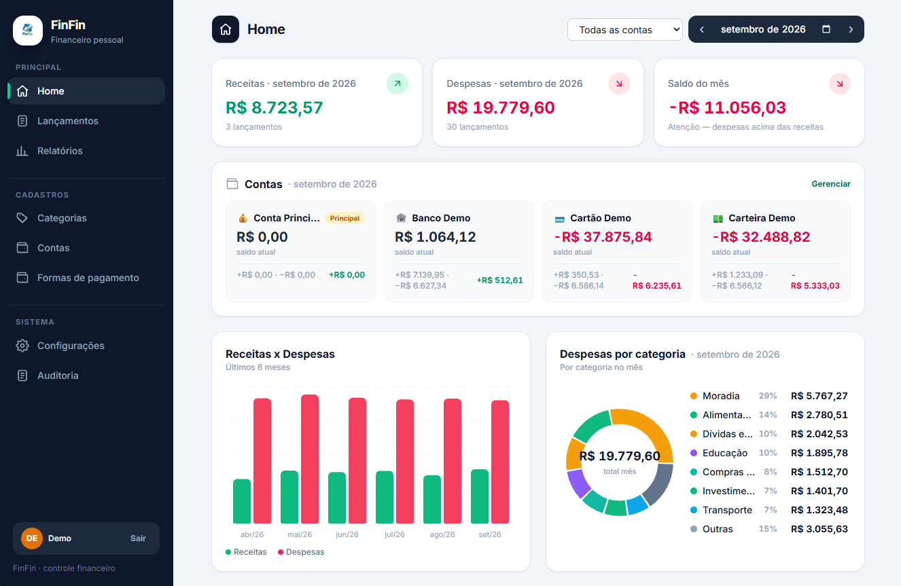

# FinFin — Financeiro Pessoal

Controle suas finanças sem planilha: registre receitas e despesas, organize por
categorias, contas e formas de pagamento, parcele no cartão, importe o extrato OFX
e acompanhe o saldo mês a mês com relatórios e gráficos. Multiusuário, com trilha
de auditoria e backup em JSON/CSV — tudo em português, rodando 100% local.

Backend NestJS + frontend React, ambos em TypeScript.



## Stack

| Camada   | Tecnologia                                                        |
| -------- | ----------------------------------------------------------------- |
| Backend  | NestJS 10 + TypeScript + TypeORM + SQLite (`better-sqlite3`)      |
| Frontend | React 19 + Vite 6 + TypeScript + Tailwind CSS v4 + React Router 7 + i18next |
| Banco    | SQLite em arquivo (`backend/data/finfin.sqlite`, criado no boot)  |

## Funcionalidades

- **Home** — resumo do mês (receitas, despesas, saldo), saldos por conta e gráficos,
  com filtro por conta (`?contaId=`)
- **Lançamentos** — CRUD de receitas/despesas com máscara BRL e filtro por mês/conta;
  despesa parcela em até 21x
- **Relatórios** — totais do mês, despesas por categoria e por forma de pagamento, últimos 6 meses,
  com filtros por conta, categoria, forma, valor e texto
- **Contas** — CRUD com saldo inicial (máscara de centavos, aceita negativo), ícone, nota e
  conta principal; exclusão bloqueada se estiver em uso
- **Categorias** — CRUD com tipo (receita/despesa) e cor; exclusão bloqueada se estiver em uso
- **Formas de pagamento** — CRUD (Dinheiro, PIX, cartões…); exclusão bloqueada se estiver em uso
- **Extrato OFX** — importa lançamentos de arquivo `.ofx` com conta destino e anti-duplicidade por FITID
- **Backup** — exporta JSON completo ou CSV (receitas/despesas) e restaura backup JSON
- **Auditoria** — trilha de CRUD + login/import/export com filtros (módulo, ação, descrição,
  período), paginação (`?pagina=&porPagina=`, até 100/pág.) e **restauração de itens excluídos**
- **Demonstração** — gera 3 contas demo com 6 meses de lançamentos em todas as categorias;
  remove só o demo sem tocar nos dados reais
- **Conta** — cadastro/login com access de 15 min (só em memória) + refresh de 7 dias
  em cookie HttpOnly com rotação, perfil com avatar, troca de senha e
  recuperação por e-mail (Resend)
- **Aparência** — tema claro/escuro/sistema e largura fluida/fixa
- **Idioma** — português (pt-BR) e inglês, com troca em Configurações → Geral (persiste em `localStorage`)

## Como rodar

Pré-requisito: Node.js 20+.

```sh
npm run setup   # instala as dependências (raiz + backend + frontend)
npm run dev     # sobe backend (:3001) + frontend (:3000) juntos
```

Abra http://localhost:3000 no navegador e crie sua conta. Para explorar sem digitar nada,
vá em **Configurações → Backup → Demonstração → Gerar demonstração**.

> **Portas**: copie `.env.example` para `.env` e ajuste `BACKEND_PORT` /
> `FRONTEND_PORT` se 3000/3001 estiverem em uso. Vale para `npm run dev`
> e para o Docker (só a porta do host muda; dentro dos contêineres o
> backend segue na 3001 e o frontend na 80).

| Comando              | O que faz                                        |
| -------------------- | ------------------------------------------------ |
| `npm run dev`        | backend (watch) + frontend juntos                |
| `npm run dev:backend`| só o backend — http://localhost:3001/api/resumo |
| `npm run dev:frontend`| só o frontend — http://localhost:3000           |
| `npm run build`      | build do backend e do frontend                   |

As chamadas do frontend usam `/api/...`, com proxy do Vite para o backend em dev.

## Como rodar com Docker

Pré-requisito: Docker 24+ com plugin Compose (`docker compose version`).

```sh
docker compose up --build   # sobe backend (:3001) + frontend (:3000)
```

Abra http://localhost:3000 no navegador. O nginx do frontend faz proxy de
`/api/...` para o serviço `backend`, então é a mesma origem do `npm run dev`.

| Comando                          | O que faz                                  |
| -------------------------------- | ------------------------------------------ |
| `docker compose up --build`      | constrói as imagens e sobe os 2 serviços   |
| `docker compose up -d --build`   | igual ao anterior, em segundo plano        |
| `docker compose logs -f`         | acompanha os logs dos 2 serviços           |
| `docker compose down`            | para e remove os contêineres (mantém dados)|

> **Mudou o código?** Repita com `--build`. Sem ele o Compose reaproveita a
> imagem antiga e o contêiner continua rodando a versão anterior.

Os dados do SQLite ficam no volume `finfin-data` (`/app/data` no contêiner do
backend). O `docker compose down` normal é seguro: remove só os contêineres e
**mantém seus lançamentos**.

> **Atenção:** `docker compose down -v` apaga o volume junto e **remove todos
> os lançamentos**. Use somente para recomeçar do zero.

```sh
docker compose down -v   # APAGA todos os lançamentos (remove o volume finfin-data)
```

## API

Base: `http://localhost:3001/api`. Rotas protegidas exigem `Authorization: Bearer <token>`
(obtido no cadastro/login); toda consulta é escopada por usuário.

| Método          | Rota                          | Descrição                              |
| --------------- | ----------------------------- | -------------------------------------- |
| `GET` / `POST`  | `/receitas[?contaId=]`        | lista (com filtro) / cria receitas     |
| `PUT` / `DELETE`| `/receitas/:id`               | edita / exclui receita (204)           |
| `GET` / `POST`  | `/despesas[?contaId=]`        | lista (com filtro) / cria despesas (até 21 parcelas) |
| `PUT` / `DELETE`| `/despesas/:id`               | edita / exclui (`?escopo=grupo` p/ parceladas) |
| `GET`           | `/resumo?mes=YYYY-MM[&contaId=]` | totais e saldo do mês (geral ou por conta) |
| `GET`           | `/contagem`                   | quantidades por coleção                |
| `GET`           | `/exportar`, `/exportar/csv?tipo=` | backup JSON / CSV (`tipo=receitas` ou `despesas`) |
| `POST`          | `/importar`, `/importar/ofx`  | restaura backup / importa extrato OFX  |
| `DELETE`        | `/dados/lancamentos`, `/dados/tudo` | apagão (zona de perigo)          |

| Método          | Rota                          | Descrição                              |
| --------------- | ----------------------------- | -------------------------------------- |
| `GET` / `POST`  | `/contas`                     | lista / cria contas                    |
| `PUT` / `DELETE`| `/contas/:id`                 | edita / exclui (409 se estiver em uso) |
| `GET` / `POST`  | `/categorias[?tipo=despesa]`  | lista (com filtro) / cria categorias   |
| `PUT` / `DELETE`| `/categorias/:id`             | edita / exclui (409 se estiver em uso) |
| `GET` / `POST`  | `/formas-pagamento`           | lista / cria formas de pagamento       |
| `PUT` / `DELETE`| `/formas-pagamento/:id`       | edita / exclui (409 se estiver em uso) |
| `POST`          | `/restaurar`                  | repõe itens padrão do catálogo         |

| Método          | Rota                                    | Descrição                              |
| --------------- | --------------------------------------- | -------------------------------------- |
| `POST` / `GET`  | `/auth/cadastro`, `/auth/login`, `/auth/eu` | cria conta / entra / sessão atual |
| `POST`          | `/auth/refresh`                         | renova o access (15 min) via cookie HttpOnly (rotação do refresh) |
| `POST`          | `/auth/logout`                          | encerra access + refresh (204)         |
| `PUT`           | `/auth/perfil`, `/auth/senha`           | atualiza perfil / troca a senha        |
| `GET` / `PUT`   | `/auth/integracoes`                     | status / salva chave do Resend         |
| `POST`          | `/auth/recuperar-senha`, `/auth/redefinir-senha` | recuperação por e-mail     |
| `GET`           | `/auditoria?modulo=&acao=&descricao=&dataInicio=&dataFim=&pagina=&porPagina=` | trilha paginada |
| `POST`          | `/auditoria/:id/restaurar`              | restaura item excluído                 |
| `DELETE`        | `/auditoria[?antesDe=YYYY-MM-DD]`       | limpa a trilha                         |
| `GET` / `POST` / `DELETE` | `/dados/demonstracao`        | status / gera / remove demo            |

Exemplo (cadastro → despesa):

```sh
TOKEN=$(curl -s -X POST localhost:3001/api/auth/cadastro \
  -H 'Content-Type: application/json' \
  -d '{"nome":"Demo","email":"demo@exemplo.com","senha":"segredo123"}' \
  | grep -o '"token":"[^"]*"' | cut -d'"' -f4)

curl -X POST localhost:3001/api/despesas \
  -H 'Content-Type: application/json' -H "Authorization: Bearer $TOKEN" \
  -d '{"data":"2026-09-15","valor":120,"categoria":"Lazer e entretenimento","descricao":"Cinema","formaPagamento":"⚡ Pix","contaId":1}'
```

## Estrutura

```
finfin/
├── backend/         # NestJS — controllers, services, entidades TypeORM (+ Dockerfile)
├── frontend/        # React — Layout com sidebar, páginas, form reutilizável (+ Dockerfile e nginx.conf)
├── docs/            # screenshot.png e logo.png (usados no README)
├── docker-compose.yml # backend (:3001) + frontend (:3000), volume finfin-data
├── .env.example     # BACKEND_PORT, FRONTEND_PORT, EMAIL_REMETENTE…
└── package.json     # runner raiz (concurrently): dev, build, setup
```

## Notas

- Os dados ficam no SQLite local — nada sai da sua máquina (`*.sqlite` e `*.ofx`
  estão no `.gitignore` e nunca devem ser commitados).
- O schema é dono das **migrations** (aplicadas no boot) — nunca reative `synchronize`.
- Rode apenas uma instância do backend por vez sobre o mesmo arquivo `.sqlite`.
- Auth: o access (Bearer, 15 min) vive só em memória no frontend; o refresh (7 dias)
  vai em cookie HttpOnly restrito a `/api/auth`. Em produção o cookie exige https
  (`COOKIE_SECURE=true`, com fail-fast no boot).
- Rate limit por IP: cadastro/login 10/min, refresh 30/min, recuperação/redefinição 5/min.
  Bodies e queries são validados com DTOs (`400` com mensagens em pt-BR).

## Licença

MIT — veja [LICENSE](LICENSE).
